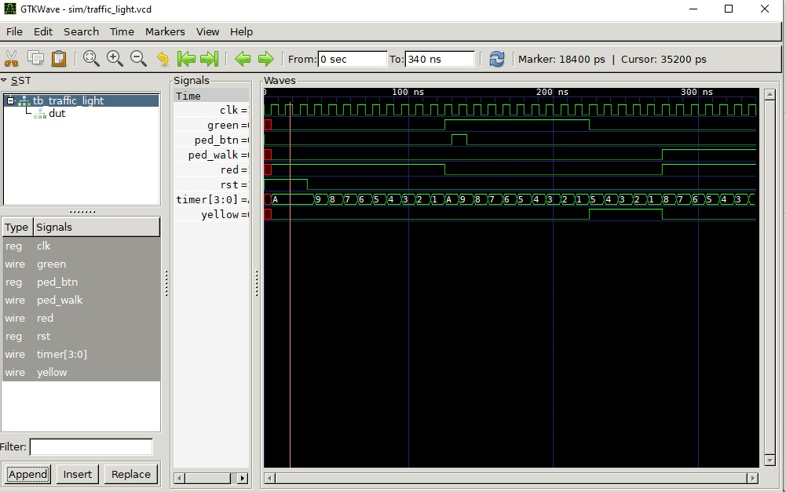

# FPGA Traffic Light Controller
> Moore FSM-based traffic light controller designed in Verilog HDL, 
> simulated using Icarus Verilog, and verified through GTKWave waveform analysis.

## Overview
This project implements a finite state machine (FSM) based traffic light 
controller targeting the Xilinx Basys 3 FPGA. The design was built 
simulation-first, with full functional verification before any hardware 
deployment. The controller manages a 4-state traffic cycle with pedestrian 
crossing support, dual-intersection coordination, and a countdown timer output.

## Features
- 4-state Moore FSM: RED → GREEN → YELLOW → PEDESTRIAN
- Pedestrian crossing input with request latching (no input is dropped)
- Dual-intersection anti-phase coordination
- 4-bit countdown timer output (compatible with 7-segment display)
- Parameterized timing for easy scaling between simulation and hardware
- Full testbench covering normal cycle, pedestrian request, and reset behavior

## Tools & Technologies
| Tool | Purpose |
|------|---------|
| Verilog HDL | Hardware description and FSM design |
| Icarus Verilog | Compilation and simulation |
| GTKWave | Waveform visualization and verification |
| VS Code | Code editing |
| Vivado (planned) | Synthesis and Basys 3 FPGA deployment |

## Project Structure
```
traffic-light-fpga/
├── src/
│   └── traffic_light_controller.v   ← Main FSM design
├── tb/
│   └── tb_traffic_light.v           ← Testbench
├── sim/
│   └── traffic_light.vcd            ← Simulation waveform data
├── docs/
│   └── waveform.png                 ← GTKWave verification screenshot
└── README.md
```

## How to Simulate
**Requirements:** Icarus Verilog, GTKWave

```bash
# Clone the repo
git clone https://github.com/Sammuel-bot/traffic-light-fpga.git
cd traffic-light-fpga

# Compile
iverilog -o sim/traffic_light.vvp src/traffic_light_controller.v tb/tb_traffic_light.v

# Run simulation
vvp sim/traffic_light.vvp

# View waveforms
gtkwave sim/traffic_light.vcd
```

## Waveform Output


## FSM State Diagram

| State | Outputs | Duration | Next State |
|-------|---------|----------|------------|
| S_RED | red=1 | RED_TIME cycles | S_GREEN |
| S_GREEN | green=1 | GREEN_TIME cycles | S_YELLOW |
| S_YELLOW | yellow=1 | YELLOW_TIME cycles | S_PED (if ped_req) or S_RED |
| S_PED | red=1, ped_walk=1 | PED_TIME cycles | S_RED |

## Simulation Results
The testbench verified the following scenarios:
- Normal RED → GREEN → YELLOW → RED cycle with correct timing
- Pedestrian button press triggers PEDESTRIAN phase after YELLOW
- Request latching ensures no button press is missed mid-cycle
- Reset snaps FSM back to RED from any state instantly
- Countdown timer decrements correctly in every phase

## Next Steps
- [ ] Add dual-intersection coordinator module
- [ ] Implement 7-segment display BCD decoder
- [ ] Scale timing parameters for Basys 3 100MHz clock
- [ ] Deploy and test on real hardware using Vivado

## Author
**Samuel Agyapong**  
Electronics Engineering Technology | Grambling State University  
GitHub: [Sammuel-bot](https://github.com/Sammuel-bot) |
Portfolio: [sammuel-bot.github.io](https://sammuel-bot.github.io)